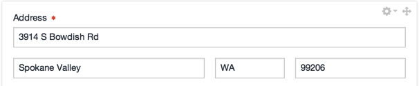

# Craft CMS Geo Address Field Type

**Version 1.0.0**

This adds a "Geo Address" field type to [Craft CMS](http://buildwithcraft/). From the control panel, it appears as a typical "Address" field, but when you save a form that uses this field, it get Geocode information from Google Maps API and saves the latitude and longitude coordinates for use in a template. That's really all it does.

## Template Variables

- `street` - user entered **street** value
- `city` - user entered **city** value
- `state` - user entered **state** value
- `zip` - user entered **zip** value
- `formattedAddress` - the formatted address as returned from the Google Maps API
- `lat` - the latitude GPS coordinates (in the form of `47.668425`)
- `lng` - the longitude GPS coordinates (in the form of `-117.085289`)

**Note** if you attach these to, say, an `address` field, they'd be accessed off of that variable: `{{ address.formattedAddress }}`.

## Me

Follow me on Twitter: [@CWSpear](https://twitter.com/CWSpear) or check out my [blog](http://cameronspear.com/blog/).